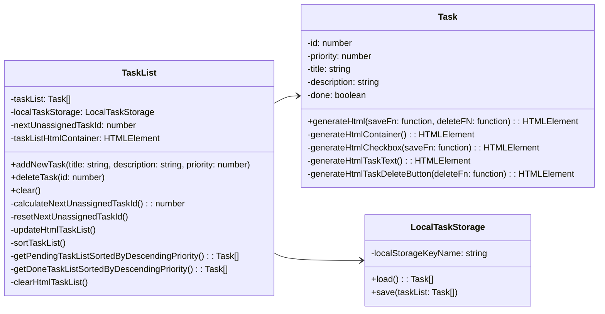

# **TODO App**
 
 

## **About**
 

A simple TODO application written with HTML, CSS and vanilla JavaScript.

 

 
 

## **Features**

The application allows you to...
* add tasks with title, priority and optional description
* see all tasks ordered by their priority and completion status
* mark tasks as completed
* delete single task
* delete all tasks

 
 

## **Data Persistence**
 

The application stores its data in the local storage of your browser. Therefore your data should not get lost when you close your browser. 

>Please note that you might have activated browser settings that automatically clear the local storage when the browser or tab is closed.

 
 

## **Documentation**
 
 

